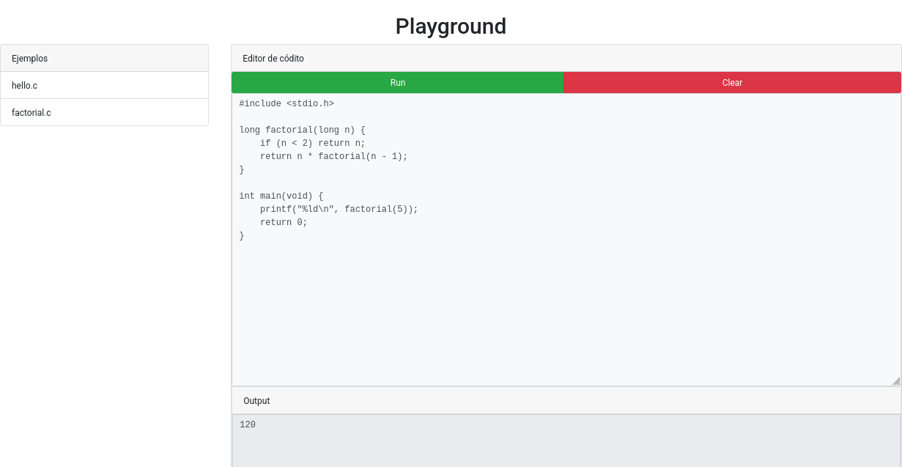

# Playground: A web interface to run code in the background

This application is intended to provide a web user interface with a
simple code editor and an output box to run code in the backend server.
It can also load a list of examples that you can provide ready to edit or
run. This tool has been built for educative purposes. It is not
intended to be used in a production environment.

## Components

The application has the following components:

* The server. A binary executable written in Nim
* The basic web user interface contained in the folder `static`
* A folder to put files to be loaded as examples: `public`
* A script that contains the code you'll be running in the background:
  `run.sh` or `run.bat` (for Windows)

A distributable package is available in the releases section for
linux-x64_86 and windows-x64_86. Just download that package and
uncompress it in your local system.

Otherwise, you can clone this repository. It is required that you have
`nim` version 2.2 installed in your system.

```sh
git clone https://github.com/jailop/playground.git
cd playground
nimble build
```

## Administration

When the server receives the edited content from the user interface, it
saves that content a file named `input.txt`. The script `run.sh` should
make use of that file to produce the desired output. In Windows, the
program will look for a scrpt named `run.bat`.

In the following example, the file `input.txt` is copied as a `C` file
and compiled. The program is run in the as the last step, the produced
files are removed.

```sh
#!/bin/sh

# Moving the input to a source code file
cp input.txt input.c
# Compiling
gcc -o object input.c
# Running the object file
./object
# Cleanning up
rm input.c object
```

The server will catch up the output and will send it to the user
interface to be shown in the output box.

To run the server:

```sh
./playground
```

## Public folder

In the `public` directory you can store example files. The server will
send the list of those files to the user interface and will provide an
endpoint, so the client will be able to retrieve the content of any
selected file contained in the `public` folder. As examples, a couple of
`C` programs are included in the package distribution.

## Web user interface

To open the user interface, use the following address in your browser:

    http://localhost:8080
    
You can replace `localhost` with the IP address of your computer if you
want access it from any other device in you network.



The user interface is defined in the files contained in the `static`
directory. In contains the following files: `index.html`, `style.css`,
and `script.js`.

The user interface contains the following components:

* The list of files
* An editor area
* An output area
* A button to run the content of the editor area
* A button to clean the content of the editor and output areas

You're invited to customize the user interface. Just keep the
relationship between the `id` attributes in the `index.html` file and
the objectecs in the `script.js` file.
